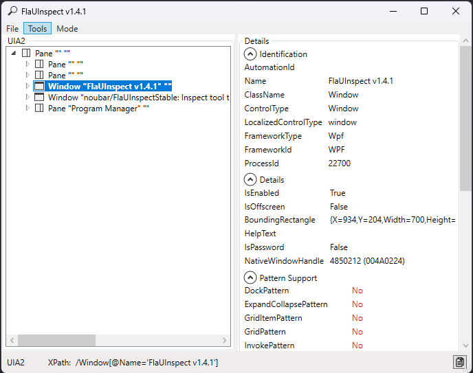

# FlaUInspectStable
Better version of FlaUInspect


### Installation
To install FlaUInspectStable, either build it yourself, or download the exe from releases here in GitHub.
this version is not available in chocolatey.

### Description
What can this version better:
* crashes less.
* remembers the last chosen UIA version.
* delivers better explicit xpaths using their names and automationids instead of index numbers which always changes.
* delivers a list of XPaths of sub-elements of the selected element as a text to be copied.
* takes a screenshot of the selected element.

There are various tools around which help inspecting application that should be ui tested or automated. Some of them are:
* VisualUIAVerify
* Inspect
* UISpy
* and probably others
Most of them are old and sometimes not very stable and (if open source), a code mess to maintain.

FlaUInspect is supposed to be a modern alternative, based on [FlaUI](https://github.com/Roemer/FlaUI).

On startup, you can choose if you want to use UIA2 or UIA3 (see [FAQ](https://github.com/Roemer/FlaUI/wiki/FAQ) why you can't use both at the same time).
###### Choose Version Dialog


###### Main Screen


## Manual

In the ```Mode``` menu, you can choose a few different options:

| Mode | Description |
| ---- | ----------- |
| Hover Mode | Enable this mode to select the item the mouse is over immediately in FlaUInspect when control is pressed |
| Focus Tracking | Enable this mode that the focused element is automatically selected in FlaUInspect |
| Specific XPath | Enables xpath generation with automationids or names |
| Show XPath | Enable this option to show a simple XPath to the current selected element in the StatusBar of FlaUInspect|

In the ```Tools``` menu, you can choose a few different options:

| Mode | Description |
| ---- | ----------- |
| Capture selected item | Takes screen shot of selected item in list of xpath tree |
| Extract Xpaths of children of selected item | Lets you copy a full list of xpaths of the children of the selected item |

In the ```File``` menu, you can choose a few different options:

| Option | Description |
| ---- | ----------- |
| New Instance | Opens a new instance of the app with the same configurations and modes of the current app |
| New Instance with version selcetion | Opens a new instance of the app with new configurations and modes  |
| Refresh | Refreshes the list fo xpaths elements and useful in case of freeze or crash |

###### More Features
For more details click [here](docs/README.md)
