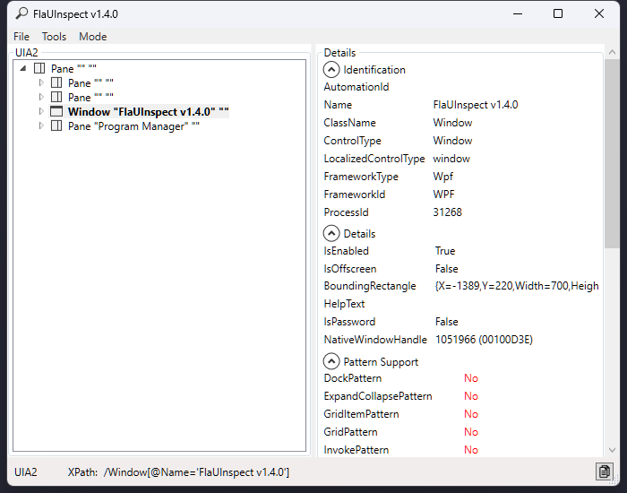

# FlaUInspect

### Build
| What | Info / Link |
| ---- | ----- |
| *Build* | [](https://ci.appveyor.com/project/RomanBaeriswyl/flauinspect) |
| *FlaUInspect* | [](https://chocolatey.org/packages/flauinspect)<br />`choco install flauinspect` |
| *CI Artefacts* | [FlauInspect CI](https://ci.appveyor.com/project/RomanBaeriswyl/flauinspect/build/artifacts) |

### Installation
To install FlaUInspect, either build it yourself, get it from chocolatey (https://community.chocolatey.org/packages/flauinspect) or get the zip from the releases page here on GitHub.

### Description
There are various tools around which help inspecting application that should be ui tested or automated. Some of them are:
* VisualUIAVerify
* Inspect
* UISpy
* and probably others
Most of them are old and sometimes not very stable and (if open source), a code mess to maintain.

FlaUInspect is supposed to be a modern alternative, based on [FlaUI](https://github.com/Roemer/FlaUI).

On startup, you can choose if you want to use UIA2 or UIA3 (see [FAQ](https://github.com/Roemer/FlaUI/wiki/FAQ) why you can't use both at the same time).
###### Choose Version Dialog


###### Main Screen


## Manual
In the ```Mode``` menu, you can choose a few different options:

| Mode | Description |
| ---- | ----------- |
| Hover Mode | Enable this mode to select the item the mouse is over immediately in FlaUInspect when control is pressed |
| Focus Tracking | Enable this mode that the focused element is automatically selected in FlaUInspect |
| Specific XPath | Enables xpath generation with automationids or names |
| Show XPath | Enable this option to show a simple XPath to the current selected element in the StatusBar of FlaUInspect|

In the ```Tools``` menu, you can choose a few different options:

| Mode | Description |
| ---- | ----------- |
| Capture selected item | Takes screen shot of seleced item in list of xpath tree |
| Extract Xpaths of children of selected item | Lets you copy a full list of xpaths of the children of the selected item |

In the ```File``` menu, you can choose a few different options:

| Option | Description |
| ---- | ----------- |
| New Instance | Opens a new instance of the app with the same configurations and modes of the current app |
| New Instance with version selcetion | Opens a new instance of the app with new configurations and modes  |
| Refresh | Refreshes the list fo xpaths elements and useful in case of freeze or crash |

###### More Features
For more details click [here](docs/README.md)
